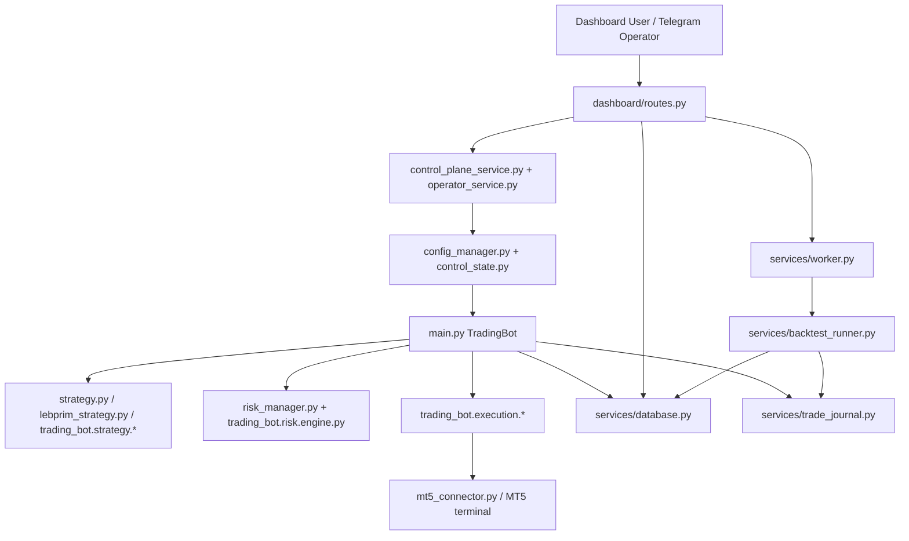

# PROJECT_CONTEXT.md

## 1. Executive Summary

This repository is a Python trading system for MetaTrader 5 focused on XAUUSD score-based scalping and controlled live execution. The clearest project name appears in [README.md](/abs/path/c:/Users/Administrator/Desktop/Trading%20Bot%20Final/README.md) as **XAUUSD MT5 Score-Based Scalping Bot**. The system combines a live bot runner in [main.py](/abs/path/c:/Users/Administrator/Desktop/Trading%20Bot%20Final/main.py), a FastAPI dashboard in [dashboard/app.py](/abs/path/c:/Users/Administrator/Desktop/Trading%20Bot%20Final/dashboard/app.py), a SQLite-backed control/reporting layer in [services/database.py](/abs/path/c:/Users/Administrator/Desktop/Trading%20Bot%20Final/services/database.py), and a queued backtest/OOS worker system in [services/worker.py](/abs/path/c:/Users/Administrator/Desktop/Trading%20Bot%20Final/services/worker.py).

The business purpose is automated and semi-automated trading: generate strategy candidates, apply risk and execution filters, place MT5 orders, manage open positions, and expose operational control through a dashboard and Telegram control plane. The main users appear to be a single operator or small trading team using the dashboard, bot process, and remote control commands defined in [dashboard/routes.py](/abs/path/c:/Users/Administrator/Desktop/Trading%20Bot%20Final/dashboard/routes.py) and [services/telegram_command_service.py](/abs/path/c:/Users/Administrator/Desktop/Trading%20Bot%20Final/services/telegram_command_service.py).

The system supports multiple runtime modes through [utils.py](/abs/path/c:/Users/Administrator/Desktop/Trading%20Bot%20Final/utils.py) and [dashboard/schemas.py](/abs/path/c:/Users/Administrator/Desktop/Trading%20Bot%20Final/dashboard/schemas.py): `DRY_RUN`, `DEMO`, `VALIDATION_TEST`, `LIVE`, and `BACKTEST`. It also supports internal strategy-engine execution modes through [trading_bot/core/execution_mode.py](/abs/path/c:/Users/Administrator/Desktop/Trading%20Bot%20Final/trading_bot/core/execution_mode.py): `V1_BASELINE`, `V2_FULL`, `V2_NO_LEBPRIM`, `V2_ADAPTIVE_ONLY`, `V2_FAMILY_MANAGEMENT_ONLY`, and `CUSTOM`.

High-level architecture is mixed rather than fully unified. Legacy core modules such as [strategy.py](/abs/path/c:/Users/Administrator/Desktop/Trading%20Bot%20Final/strategy.py), [risk_manager.py](/abs/path/c:/Users/Administrator/Desktop/Trading%20Bot%20Final/risk_manager.py), and [mt5_connector.py](/abs/path/c:/Users/Administrator/Desktop/Trading%20Bot%20Final/mt5_connector.py) still drive major behavior, while newer typed modules under [trading_bot/](/abs/path/c:/Users/Administrator/Desktop/Trading%20Bot%20Final/trading_bot) provide execution, strategy validation, backtest support, and config normalization. [strategy_factory.py](/abs/path/c:/Users/Administrator/Desktop/Trading%20Bot%20Final/strategy_factory.py) is the clearest bridge between the legacy and newer architecture.

## 2. Technology Stack

### Languages and core runtime

- Python is the main implementation language across [main.py](/abs/path/c:/Users/Administrator/Desktop/Trading%20Bot%20Final/main.py), [services/](/abs/path/c:/Users/Administrator/Desktop/Trading%20Bot%20Final/services), [dashboard/](/abs/path/c:/Users/Administrator/Desktop/Trading%20Bot%20Final/dashboard), and [trading_bot/](/abs/path/c:/Users/Administrator/Desktop/Trading%20Bot%20Final/trading_bot).
- JavaScript and CSS are used for the dashboard client in [dashboard/static/dashboard.js](/abs/path/c:/Users/Administrator/Desktop/Trading%20Bot%20Final/dashboard/static/dashboard.js) and [dashboard/static/dashboard.css](/abs/path/c:/Users/Administrator/Desktop/Trading%20Bot%20Final/dashboard/static/dashboard.css).
- HTML with Jinja2 templates is used in [dashboard/templates/base.html](/abs/path/c:/Users/Administrator/Desktop/Trading%20Bot%20Final/dashboard/templates/base.html) and [dashboard/templates/index.html](/abs/path/c:/Users/Administrator/Desktop/Trading%20Bot%20Final/dashboard/templates/index.html).
- Windows batch and PowerShell helpers are present in [Start Bot.bat](/abs/path/c:/Users/Administrator/Desktop/Trading%20Bot%20Final/Start%20Bot.bat), [Start Dashboard.bat](/abs/path/c:/Users/Administrator/Desktop/Trading%20Bot%20Final/Start%20Dashboard.bat), and [scripts/install_tasks.ps1](/abs/path/c:/Users/Administrator/Desktop/Trading%20Bot%20Final/scripts/install_tasks.ps1).

### Backend stack

- FastAPI and Uvicorn are listed in [requirements.txt](/abs/path/c:/Users/Administrator/Desktop/Trading%20Bot%20Final/requirements.txt) and used by [dashboard/app.py](/abs/path/c:/Users/Administrator/Desktop/Trading%20Bot%20Final/dashboard/app.py) and [scripts/run_dashboard.py](/abs/path/c:/Users/Administrator/Desktop/Trading%20Bot%20Final/scripts/run_dashboard.py).
- Jinja2 is listed in [requirements.txt](/abs/path/c:/Users/Administrator/Desktop/Trading%20Bot%20Final/requirements.txt) and used by [dashboard/app.py](/abs/path/c:/Users/Administrator/Desktop/Trading%20Bot%20Final/dashboard/app.py).
- `requests` is listed in [requirements.txt](/abs/path/c:/Users/Administrator/Desktop/Trading%20Bot%20Final/requirements.txt) and used for Telegram polling in [services/telegram_command_service.py](/abs/path/c:/Users/Administrator/Desktop/Trading%20Bot%20Final/services/telegram_command_service.py).

### Trading and analytics stack

- `MetaTrader5` is listed in [requirements.txt](/abs/path/c:/Users/Administrator/Desktop/Trading%20Bot%20Final/requirements.txt) and integrated through [mt5_connector.py](/abs/path/c:/Users/Administrator/Desktop/Trading%20Bot%20Final/mt5_connector.py) and [trading_bot/execution/mt5_broker.py](/abs/path/c:/Users/Administrator/Desktop/Trading%20Bot%20Final/trading_bot/execution/mt5_broker.py).
- `pandas`, `numpy`, and `ta` are listed in [requirements.txt](/abs/path/c:/Users/Administrator/Desktop/Trading%20Bot%20Final/requirements.txt) and support indicator, scoring, and report logic in files such as [indicators.py](/abs/path/c:/Users/Administrator/Desktop/Trading%20Bot%20Final/indicators.py), [strategy.py](/abs/path/c:/Users/Administrator/Desktop/Trading%20Bot%20Final/strategy.py), and [services/backtest_storage.py](/abs/path/c:/Users/Administrator/Desktop/Trading%20Bot%20Final/services/backtest_storage.py).

### Frontend stack

- Bootstrap 5 and Bootstrap Icons are loaded from CDN in [dashboard/templates/base.html](/abs/path/c:/Users/Administrator/Desktop/Trading%20Bot%20Final/dashboard/templates/base.html).
- The frontend is vanilla JS rather than React/Vue. All major UI behavior is centralized in [dashboard/static/dashboard.js](/abs/path/c:/Users/Administrator/Desktop/Trading%20Bot%20Final/dashboard/static/dashboard.js).
- `streamlit` is listed in [requirements.txt](/abs/path/c:/Users/Administrator/Desktop/Trading%20Bot%20Final/requirements.txt), but no active runtime `streamlit` entry point was found in the scanned codebase.

### Database and storage

- SQLite is the main persistent store, implemented in [services/database.py](/abs/path/c:/Users/Administrator/Desktop/Trading%20Bot%20Final/services/database.py) and configured by default to `storage/bot.db` in [config.json](/abs/path/c:/Users/Administrator/Desktop/Trading%20Bot%20Final/config.json).
- JSON files are used for mutable control and runtime state in [services/control_state.py](/abs/path/c:/Users/Administrator/Desktop/Trading%20Bot%20Final/services/control_state.py), [services/state_manager.py](/abs/path/c:/Users/Administrator/Desktop/Trading%20Bot%20Final/services/state_manager.py), and [services/trade_journal.py](/abs/path/c:/Users/Administrator/Desktop/Trading%20Bot%20Final/services/trade_journal.py).
- CSV and Markdown reports are generated by [services/trade_journal.py](/abs/path/c:/Users/Administrator/Desktop/Trading%20Bot%20Final/services/trade_journal.py) and [services/backtest_storage.py](/abs/path/c:/Users/Administrator/Desktop/Trading%20Bot%20Final/services/backtest_storage.py).

### External services and APIs

- MetaTrader 5 terminal and broker connectivity are handled in [mt5_connector.py](/abs/path/c:/Users/Administrator/Desktop/Trading%20Bot%20Final/mt5_connector.py).
- Telegram Bot API integration is implemented in [services/telegram_notifier.py](/abs/path/c:/Users/Administrator/Desktop/Trading%20Bot%20Final/services/telegram_notifier.py) and [services/telegram_command_service.py](/abs/path/c:/Users/Administrator/Desktop/Trading%20Bot%20Final/services/telegram_command_service.py).

### Testing and tooling

- The test framework is `pytest`, inferred from the `tests/` suite and commands used throughout the repo, including [tests/test_unified_architecture.py](/abs/path/c:/Users/Administrator/Desktop/Trading%20Bot%20Final/tests/test_unified_architecture.py).
- Dependency installation is documented in [README.md](/abs/path/c:/Users/Administrator/Desktop/Trading%20Bot%20Final/README.md) and [requirements.txt](/abs/path/c:/Users/Administrator/Desktop/Trading%20Bot%20Final/requirements.txt).
- No dedicated `pyproject.toml`, `package.json`, or lint/typecheck configuration was found in the scanned root.

## 3. Repository Structure

```text
.
|- main.py
|- strategy.py
|- risk_manager.py
|- mt5_connector.py
|- lebprim_strategy.py
|- strategy_factory.py
|- utils.py
|- logger.py
|- config.json
|- requirements.txt
|- README.md
|- dashboard/
|  |- app.py
|  |- auth.py
|  |- routes.py
|  |- schemas.py
|  |- services.py
|  |- queries.py
|  |- query_utils.py
|  |- static/
|  |  |- dashboard.js
|  |  `- dashboard.css
|  `- templates/
|     |- base.html
|     `- index.html
|- services/
|  |- database.py
|  |- config_manager.py
|  |- control_state.py
|  |- control_plane_service.py
|  |- bot_control_service.py
|  |- operator_service.py
|  |- manual_trade_service.py
|  |- trade_journal.py
|  |- worker.py
|  |- job_service.py
|  |- backtest_runner.py
|  |- backtest_storage.py
|  |- oos_service.py
|  |- history_loader.py
|  |- historical_feed.py
|  |- live_feed.py
|  |- telegram_command_service.py
|  `- telegram_notifier.py
|- trading_bot/
|  |- app/
|  |- analytics/
|  |- backtest/
|  |- config/
|  |- core/
|  |- execution/
|  |- positions/
|  |- risk/
|  |- storage/
|  `- strategy/
|- scripts/
|  |- run_dashboard.py
|  |- run_worker.py
|  |- run_oos_evaluation.py
|  |- bootstrap_launcher.py
|  |- validate_journaling.py
|  |- debug_trade_lifecycle.py
|  `- install_tasks.ps1
|- tests/
`- reports/
```

- Root runtime modules such as [main.py](/abs/path/c:/Users/Administrator/Desktop/Trading%20Bot%20Final/main.py), [strategy.py](/abs/path/c:/Users/Administrator/Desktop/Trading%20Bot%20Final/strategy.py), [risk_manager.py](/abs/path/c:/Users/Administrator/Desktop/Trading%20Bot%20Final/risk_manager.py), and [mt5_connector.py](/abs/path/c:/Users/Administrator/Desktop/Trading%20Bot%20Final/mt5_connector.py) contain the bot's oldest and most operationally sensitive logic.
- [dashboard/](/abs/path/c:/Users/Administrator/Desktop/Trading%20Bot%20Final/dashboard) contains the HTTP UI layer: FastAPI app assembly, route handlers, schemas, template rendering, and browser-side dashboard logic.
- [services/](/abs/path/c:/Users/Administrator/Desktop/Trading%20Bot%20Final/services) contains the application's control plane, database access, worker queue, job orchestration, journaling, historical data loading, and notification services.
- [trading_bot/](/abs/path/c:/Users/Administrator/Desktop/Trading%20Bot%20Final/trading_bot) is the newer domain package containing typed interfaces, execution models, risk wrappers, strategy adapters, and backtest/OOS modules.
- [scripts/](/abs/path/c:/Users/Administrator/Desktop/Trading%20Bot%20Final/scripts) contains operational launchers, validation helpers, and one-off support CLIs.
- [tests/](/abs/path/c:/Users/Administrator/Desktop/Trading%20Bot%20Final/tests) contains regression tests for architecture boundaries, trade lifecycle correctness, job/worker behavior, dashboard APIs, and mode separation.
- [reports/](/abs/path/c:/Users/Administrator/Desktop/Trading%20Bot%20Final/reports) appears to hold generated reports and human-authored audit documents rather than core runtime code. Treat it as reference material, not authoritative implementation.
- [tradingbot/](/abs/path/c:/Users/Administrator/Desktop/Trading%20Bot%20Final/tradingbot) exists but appears unused or empty from the scanned tree. Its purpose is unclear from the codebase.

## 4. Main Entry Points

### Live bot process

- [main.py](/abs/path/c:/Users/Administrator/Desktop/Trading%20Bot%20Final/main.py) defines `class TradingBot` and `main()`. This is the primary bot runner.
- It is started directly with `py -3.11 main.py` per [README.md](/abs/path/c:/Users/Administrator/Desktop/Trading%20Bot%20Final/README.md), or via [Start Bot.bat](/abs/path/c:/Users/Administrator/Desktop/Trading%20Bot%20Final/Start%20Bot.bat) and [scripts/start_bot.bat](/abs/path/c:/Users/Administrator/Desktop/Trading%20Bot%20Final/scripts/start_bot.bat) if present in the environment.
- `main()` also supports utility flags in [main.py](/abs/path/c:/Users/Administrator/Desktop/Trading%20Bot%20Final/main.py): `--diagnostics`, `--reconcile-trades`, `--finalize-unresolved`, `--generate-daily-report`, and `--report-day`.

### Dashboard server

- [dashboard/app.py](/abs/path/c:/Users/Administrator/Desktop/Trading%20Bot%20Final/dashboard/app.py) builds the FastAPI app and wires shared services into `app.state`.
- [scripts/run_dashboard.py](/abs/path/c:/Users/Administrator/Desktop/Trading%20Bot%20Final/scripts/run_dashboard.py) is the operational launcher for the dashboard server.
- [Start Dashboard.bat](/abs/path/c:/Users/Administrator/Desktop/Trading%20Bot%20Final/Start%20Dashboard.bat) and [Start Dashboard Hidden.bat](/abs/path/c:/Users/Administrator/Desktop/Trading%20Bot%20Final/Start%20Dashboard%20Hidden.bat) are Windows-oriented launchers.

### Worker process

- [scripts/run_worker.py](/abs/path/c:/Users/Administrator/Desktop/Trading%20Bot%20Final/scripts/run_worker.py) starts the background `WorkerService` from [services/worker.py](/abs/path/c:/Users/Administrator/Desktop/Trading%20Bot%20Final/services/worker.py).
- The worker executes queued `BACKTEST` and `OOS_EVALUATION` jobs persisted in SQLite by [services/job_service.py](/abs/path/c:/Users/Administrator/Desktop/Trading%20Bot%20Final/services/job_service.py).

### OOS evaluation runner

- [scripts/run_oos_evaluation.py](/abs/path/c:/Users/Administrator/Desktop/Trading%20Bot%20Final/scripts/run_oos_evaluation.py) is a direct CLI entry for out-of-sample evaluation orchestration.
- The underlying framework lives in [trading_bot/backtest/oos_evaluation.py](/abs/path/c:/Users/Administrator/Desktop/Trading%20Bot%20Final/trading_bot/backtest/oos_evaluation.py).

### Validation and debugging utilities

- [scripts/validate_journaling.py](/abs/path/c:/Users/Administrator/Desktop/Trading%20Bot%20Final/scripts/validate_journaling.py) validates journaling assumptions.
- [scripts/debug_trade_lifecycle.py](/abs/path/c:/Users/Administrator/Desktop/Trading%20Bot%20Final/scripts/debug_trade_lifecycle.py) helps inspect lifecycle consistency.
- [scripts/bootstrap_launcher.py](/abs/path/c:/Users/Administrator/Desktop/Trading%20Bot%20Final/scripts/bootstrap_launcher.py) appears to coordinate startup ordering and waiting behavior.

## 5. Core Modules and Responsibilities

### Runtime orchestration

- [main.py](/abs/path/c:/Users/Administrator/Desktop/Trading%20Bot%20Final/main.py)
  - Main types/functions: `TradingBot`, `startup()`, `run()`, `process_cycle()`, `_attempt_entry()`, `shutdown()`.
  - Responsibility: full live loop orchestration, MT5 connection lifecycle, candidate generation, risk checks, execution submission, journaling, and periodic reporting.
  - Depends on: [mt5_connector.py](/abs/path/c:/Users/Administrator/Desktop/Trading%20Bot%20Final/mt5_connector.py), [strategy_factory.py](/abs/path/c:/Users/Administrator/Desktop/Trading%20Bot%20Final/strategy_factory.py), [risk_manager.py](/abs/path/c:/Users/Administrator/Desktop/Trading%20Bot%20Final/risk_manager.py), [services/database.py](/abs/path/c:/Users/Administrator/Desktop/Trading%20Bot%20Final/services/database.py), [services/trade_journal.py](/abs/path/c:/Users/Administrator/Desktop/Trading%20Bot%20Final/services/trade_journal.py), and newer modules under [trading_bot/](/abs/path/c:/Users/Administrator/Desktop/Trading%20Bot%20Final/trading_bot).
  - Side effects: places or simulates trades, writes DB rows, updates JSON state, writes logs, and sends Telegram notifications.

### Strategy engines

- [strategy.py](/abs/path/c:/Users/Administrator/Desktop/Trading%20Bot%20Final/strategy.py)
  - Main type: `StrategyEngine`.
  - Responsibility: legacy multi-family candidate generation and entry evaluation.
  - Key family builders: `_trend_pullback_reclaim`, `_breakout_retest_continuation`, `_liquidity_sweep_reversal`, `_compression_release`.
  - Consumers: [main.py](/abs/path/c:/Users/Administrator/Desktop/Trading%20Bot%20Final/main.py), [strategy_factory.py](/abs/path/c:/Users/Administrator/Desktop/Trading%20Bot%20Final/strategy_factory.py), tests in [tests/test_execution_flow.py](/abs/path/c:/Users/Administrator/Desktop/Trading%20Bot%20Final/tests/test_execution_flow.py) and [tests/test_unified_architecture.py](/abs/path/c:/Users/Administrator/Desktop/Trading%20Bot%20Final/tests/test_unified_architecture.py).

- [lebprim_strategy.py](/abs/path/c:/Users/Administrator/Desktop/Trading%20Bot%20Final/lebprim_strategy.py)
  - Main type: `LebprimStrategy`.
  - Responsibility: specialized LEBPRIM scalp candidate generation and entry logic, including pending limit-entry metadata.
  - Consumers: [strategy_factory.py](/abs/path/c:/Users/Administrator/Desktop/Trading%20Bot%20Final/strategy_factory.py), [trading_bot/strategy/adapters.py](/abs/path/c:/Users/Administrator/Desktop/Trading%20Bot%20Final/trading_bot/strategy/adapters.py), and [tests/test_lebprim_execution.py](/abs/path/c:/Users/Administrator/Desktop/Trading%20Bot%20Final/tests/test_lebprim_execution.py).

- [strategy_factory.py](/abs/path/c:/Users/Administrator/Desktop/Trading%20Bot%20Final/strategy_factory.py)
  - Main function: `build_strategy_engine`.
  - Responsibility: choose the legacy `StrategyEngine` or newer `UnifiedStrategyEngine` based on execution mode.
  - This file is a critical architecture switchboard.

- [trading_bot/strategy/engine.py](/abs/path/c:/Users/Administrator/Desktop/Trading%20Bot%20Final/trading_bot/strategy/engine.py)
  - Main type: `UnifiedStrategyEngine`.
  - Responsibility: V2 strategy aggregation, adapter coordination, and candidate quality validation.
  - Depends on: [trading_bot/strategy/registry.py](/abs/path/c:/Users/Administrator/Desktop/Trading%20Bot%20Final/trading_bot/strategy/registry.py), [trading_bot/strategy/adapters.py](/abs/path/c:/Users/Administrator/Desktop/Trading%20Bot%20Final/trading_bot/strategy/adapters.py), and [trading_bot/strategy/validation.py](/abs/path/c:/Users/Administrator/Desktop/Trading%20Bot%20Final/trading_bot/strategy/validation.py).

### Risk and execution

- [risk_manager.py](/abs/path/c:/Users/Administrator/Desktop/Trading%20Bot%20Final/risk_manager.py)
  - Main type: `RiskManager`.
  - Responsibility: risk gating, stop/target calculation, position sizing, and trade management actions.
  - Side effects: mutates risk state and cooldown state consumed by [main.py](/abs/path/c:/Users/Administrator/Desktop/Trading%20Bot%20Final/main.py).

- [trading_bot/risk/engine.py](/abs/path/c:/Users/Administrator/Desktop/Trading%20Bot%20Final/trading_bot/risk/engine.py)
  - Main type: `RiskEngine`.
  - Responsibility: structured wrapper around legacy risk calculations, including execution approval decisions.

- [trading_bot/execution/decision_engine.py](/abs/path/c:/Users/Administrator/Desktop/Trading%20Bot%20Final/trading_bot/execution/decision_engine.py)
  - Main types: `ExecutionDecisionEngine`, `EntryExecutionPolicy`.
  - Responsibility: decide between `EXECUTE_NOW`, `WAIT_RETEST`, `PLACE_LIMIT`, or `BLOCK`.

- [trading_bot/execution/execution_service.py](/abs/path/c:/Users/Administrator/Desktop/Trading%20Bot%20Final/trading_bot/execution/execution_service.py)
  - Main type: `ExecutionService`.
  - Responsibility: submit normalized `ExecutionRequest` objects to a broker adapter.

- [trading_bot/execution/mt5_broker.py](/abs/path/c:/Users/Administrator/Desktop/Trading%20Bot%20Final/trading_bot/execution/mt5_broker.py)
  - Main type: `MT5Broker`.
  - Responsibility: adapt the abstract broker contract to [mt5_connector.py](/abs/path/c:/Users/Administrator/Desktop/Trading%20Bot%20Final/mt5_connector.py).

- [trading_bot/execution/exposure_policy.py](/abs/path/c:/Users/Administrator/Desktop/Trading%20Bot%20Final/trading_bot/execution/exposure_policy.py)
  - Main type: `ExposurePolicy`.
  - Responsibility: cap multi-position, same-family, same-direction, and portfolio-level risk concentration.

- [trading_bot/execution/pending_policy.py](/abs/path/c:/Users/Administrator/Desktop/Trading%20Bot%20Final/trading_bot/execution/pending_policy.py)
  - Main type: `PendingOrderPolicy`.
  - Responsibility: cancel or preserve pending orders based on quality decay and market-context changes.

### MT5 and market data

- [mt5_connector.py](/abs/path/c:/Users/Administrator/Desktop/Trading%20Bot%20Final/mt5_connector.py)
  - Main type: `MT5Connector`.
  - Responsibility: connect/login to MT5, fetch rates/ticks, validate symbol state, place/modify/close orders, and resolve historical trade information.
  - This is one of the most sensitive files because it owns real trading side effects.

- [services/live_feed.py](/abs/path/c:/Users/Administrator/Desktop/Trading%20Bot%20Final/services/live_feed.py)
  - Responsibility: live market data feed abstraction over MT5 polling.

- [services/historical_feed.py](/abs/path/c:/Users/Administrator/Desktop/Trading%20Bot%20Final/services/historical_feed.py)
  - Responsibility: replay-safe historical feed for backtests.

- [services/history_loader.py](/abs/path/c:/Users/Administrator/Desktop/Trading%20Bot%20Final/services/history_loader.py)
  - Responsibility: resolve historical bars/ticks from MT5, SQLite cache, or CSV fallback sources.

### Dashboard and control plane

- [dashboard/app.py](/abs/path/c:/Users/Administrator/Desktop/Trading%20Bot%20Final/dashboard/app.py)
  - Responsibility: build the FastAPI app and initialize shared services.

- [dashboard/routes.py](/abs/path/c:/Users/Administrator/Desktop/Trading%20Bot%20Final/dashboard/routes.py)
  - Responsibility: expose the HTTP control, reporting, manual-trade, job, replay, and config APIs.

- [services/config_manager.py](/abs/path/c:/Users/Administrator/Desktop/Trading%20Bot%20Final/services/config_manager.py)
  - Main type: `ConfigManager`.
  - Responsibility: validate, persist, classify, back up, and present config changes.

- [services/control_state.py](/abs/path/c:/Users/Administrator/Desktop/Trading%20Bot%20Final/services/control_state.py)
  - Main type: `ControlStateService`.
  - Responsibility: durable cross-process bot control state with lock-protected JSON updates.

- [services/control_plane_service.py](/abs/path/c:/Users/Administrator/Desktop/Trading%20Bot%20Final/services/control_plane_service.py)
  - Main type: `ControlPlaneService`.
  - Responsibility: central mutation interface for dashboard and remote control operations.

- [services/bot_control_service.py](/abs/path/c:/Users/Administrator/Desktop/Trading%20Bot%20Final/services/bot_control_service.py)
  - Main type: `BotControlService`.
  - Responsibility: start/stop detached bot process, pause/resume execution, toggle kill switch, and request reloads.

- [services/operator_service.py](/abs/path/c:/Users/Administrator/Desktop/Trading%20Bot%20Final/services/operator_service.py)
  - Main type: `OperatorService`.
  - Responsibility: high-level operator actions, including presets and guarded mode switches.

### Backtesting, OOS, and jobs

- [services/backtest_runner.py](/abs/path/c:/Users/Administrator/Desktop/Trading%20Bot%20Final/services/backtest_runner.py)
  - Main type: `BacktestRunner`.
  - Responsibility: run historical simulations with execution and risk logic close to live behavior.

- [trading_bot/backtest/runner.py](/abs/path/c:/Users/Administrator/Desktop/Trading%20Bot%20Final/trading_bot/backtest/runner.py)
  - Responsibility: re-export layer only. The actual implementation is in [services/backtest_runner.py](/abs/path/c:/Users/Administrator/Desktop/Trading%20Bot%20Final/services/backtest_runner.py).

- [services/backtest_storage.py](/abs/path/c:/Users/Administrator/Desktop/Trading%20Bot%20Final/services/backtest_storage.py)
  - Responsibility: persist and export run artifacts, summaries, playback, CSVs, and HTML charts.

- [trading_bot/backtest/oos_evaluation.py](/abs/path/c:/Users/Administrator/Desktop/Trading%20Bot%20Final/trading_bot/backtest/oos_evaluation.py)
  - Main type: `OOSEvaluationFramework`.
  - Responsibility: evaluate scenario matrices and generate comparative reports.

- [services/job_service.py](/abs/path/c:/Users/Administrator/Desktop/Trading%20Bot%20Final/services/job_service.py)
  - Main type: `JobService`.
  - Responsibility: create, resume, cancel, and reconcile job records in SQLite.

- [services/worker.py](/abs/path/c:/Users/Administrator/Desktop/Trading%20Bot%20Final/services/worker.py)
  - Main type: `WorkerService`.
  - Responsibility: poll the jobs table, claim work, heartbeat running jobs, and finalize outcomes.

### Persistence and journaling

- [services/database.py](/abs/path/c:/Users/Administrator/Desktop/Trading%20Bot%20Final/services/database.py)
  - Main type: `DatabaseService`.
  - Responsibility: schema initialization, DB CRUD, reporting queries, trade lifecycle repair, job storage, and replay storage.

- [services/trade_journal.py](/abs/path/c:/Users/Administrator/Desktop/Trading%20Bot%20Final/services/trade_journal.py)
  - Main type: `TradeJournalService`.
  - Responsibility: canonical journal events, outbox retry behavior, and daily report generation.

- [logger.py](/abs/path/c:/Users/Administrator/Desktop/Trading%20Bot%20Final/logger.py)
  - Main type: `BotLogger`.
  - Responsibility: rotating file logs and daily CSV analytics outputs.

## 6. Architecture Overview

The architecture is best understood as five layers connected by a shared config/control plane.

1. Operator interfaces: dashboard HTTP routes in [dashboard/routes.py](/abs/path/c:/Users/Administrator/Desktop/Trading%20Bot%20Final/dashboard/routes.py) and Telegram commands in [services/telegram_command_service.py](/abs/path/c:/Users/Administrator/Desktop/Trading%20Bot%20Final/services/telegram_command_service.py).
2. Control plane and config: [services/config_manager.py](/abs/path/c:/Users/Administrator/Desktop/Trading%20Bot%20Final/services/config_manager.py), [services/control_state.py](/abs/path/c:/Users/Administrator/Desktop/Trading%20Bot%20Final/services/control_state.py), [services/control_plane_service.py](/abs/path/c:/Users/Administrator/Desktop/Trading%20Bot%20Final/services/control_plane_service.py), and [services/operator_service.py](/abs/path/c:/Users/Administrator/Desktop/Trading%20Bot%20Final/services/operator_service.py).
3. Runtime engine: [main.py](/abs/path/c:/Users/Administrator/Desktop/Trading%20Bot%20Final/main.py), [strategy_factory.py](/abs/path/c:/Users/Administrator/Desktop/Trading%20Bot%20Final/strategy_factory.py), [strategy.py](/abs/path/c:/Users/Administrator/Desktop/Trading%20Bot%20Final/strategy.py), [lebprim_strategy.py](/abs/path/c:/Users/Administrator/Desktop/Trading%20Bot%20Final/lebprim_strategy.py), [risk_manager.py](/abs/path/c:/Users/Administrator/Desktop/Trading%20Bot%20Final/risk_manager.py), and newer execution/risk modules under [trading_bot/](/abs/path/c:/Users/Administrator/Desktop/Trading%20Bot%20Final/trading_bot).
4. Integration layer: [mt5_connector.py](/abs/path/c:/Users/Administrator/Desktop/Trading%20Bot%20Final/mt5_connector.py), [trading_bot/execution/mt5_broker.py](/abs/path/c:/Users/Administrator/Desktop/Trading%20Bot%20Final/trading_bot/execution/mt5_broker.py), [services/history_loader.py](/abs/path/c:/Users/Administrator/Desktop/Trading%20Bot%20Final/services/history_loader.py), and Telegram modules.
5. Persistence/reporting/async jobs: [services/database.py](/abs/path/c:/Users/Administrator/Desktop/Trading%20Bot%20Final/services/database.py), [services/trade_journal.py](/abs/path/c:/Users/Administrator/Desktop/Trading%20Bot%20Final/services/trade_journal.py), [services/backtest_storage.py](/abs/path/c:/Users/Administrator/Desktop/Trading%20Bot%20Final/services/backtest_storage.py), [services/worker.py](/abs/path/c:/Users/Administrator/Desktop/Trading%20Bot%20Final/services/worker.py), and [services/job_service.py](/abs/path/c:/Users/Administrator/Desktop/Trading%20Bot%20Final/services/job_service.py).



### Backend architecture

- The backend is not split into separate microservices. It is a set of cooperating Python processes sharing SQLite and JSON state, centered on [main.py](/abs/path/c:/Users/Administrator/Desktop/Trading%20Bot%20Final/main.py), [dashboard/app.py](/abs/path/c:/Users/Administrator/Desktop/Trading%20Bot%20Final/dashboard/app.py), and [services/worker.py](/abs/path/c:/Users/Administrator/Desktop/Trading%20Bot%20Final/services/worker.py).

### Frontend/dashboard architecture

- The dashboard server renders one main HTML shell from [dashboard/templates/index.html](/abs/path/c:/Users/Administrator/Desktop/Trading%20Bot%20Final/dashboard/templates/index.html), then the browser runs a large client controller in [dashboard/static/dashboard.js](/abs/path/c:/Users/Administrator/Desktop/Trading%20Bot%20Final/dashboard/static/dashboard.js) that calls JSON endpoints in [dashboard/routes.py](/abs/path/c:/Users/Administrator/Desktop/Trading%20Bot%20Final/dashboard/routes.py).

### Data and service layer

- SQLite persists runtime history and async workloads through [services/database.py](/abs/path/c:/Users/Administrator/Desktop/Trading%20Bot%20Final/services/database.py).
- Mutable bot state and operator intent are split between [services/state_manager.py](/abs/path/c:/Users/Administrator/Desktop/Trading%20Bot%20Final/services/state_manager.py) and [services/control_state.py](/abs/path/c:/Users/Administrator/Desktop/Trading%20Bot%20Final/services/control_state.py).
- Config is normalized in [utils.py](/abs/path/c:/Users/Administrator/Desktop/Trading%20Bot%20Final/utils.py) and [trading_bot/config/schema.py](/abs/path/c:/Users/Administrator/Desktop/Trading%20Bot%20Final/trading_bot/config/schema.py), then persisted and audited through [services/config_manager.py](/abs/path/c:/Users/Administrator/Desktop/Trading%20Bot%20Final/services/config_manager.py) and [services/audit_service.py](/abs/path/c:/Users/Administrator/Desktop/Trading%20Bot%20Final/services/audit_service.py).

## 7. End-to-End Data Flows

### Application startup flow

Trigger: starting [main.py](/abs/path/c:/Users/Administrator/Desktop/Trading%20Bot%20Final/main.py).

1. `main()` loads runtime config from [utils.py](/abs/path/c:/Users/Administrator/Desktop/Trading%20Bot%20Final/utils.py).
2. `TradingBot.__init__` composes connector, risk, strategy, database, execution, and journal services in [main.py](/abs/path/c:/Users/Administrator/Desktop/Trading%20Bot%20Final/main.py).
3. `startup()` initializes MT5 through [mt5_connector.py](/abs/path/c:/Users/Administrator/Desktop/Trading%20Bot%20Final/mt5_connector.py), validates startup state, syncs risk state, reconciles unresolved trades, and starts Telegram command polling through [services/telegram_command_service.py](/abs/path/c:/Users/Administrator/Desktop/Trading%20Bot%20Final/services/telegram_command_service.py).
4. Startup events and heartbeat rows are persisted through [services/database.py](/abs/path/c:/Users/Administrator/Desktop/Trading%20Bot%20Final/services/database.py).

### Live cycle flow

Trigger: each bot loop iteration in `process_cycle()` in [main.py](/abs/path/c:/Users/Administrator/Desktop/Trading%20Bot%20Final/main.py).

1. Apply runtime updates from config/control state.
2. Flush journal outbox through [services/trade_journal.py](/abs/path/c:/Users/Administrator/Desktop/Trading%20Bot%20Final/services/trade_journal.py).
3. If mode is `BACKTEST`, emit idle heartbeat and stop further live actions.
4. Reconcile unresolved positions and refresh risk state.
5. Fetch live market data from [mt5_connector.py](/abs/path/c:/Users/Administrator/Desktop/Trading%20Bot%20Final/mt5_connector.py).
6. Build market context through the selected strategy engine from [strategy_factory.py](/abs/path/c:/Users/Administrator/Desktop/Trading%20Bot%20Final/strategy_factory.py).
7. Manage existing and pending positions before looking for new entries.
8. Generate setup candidates and evaluate best candidate.
9. Run risk gate, degraded gate, exposure checks, and execution decision logic using [risk_manager.py](/abs/path/c:/Users/Administrator/Desktop/Trading%20Bot%20Final/risk_manager.py), [trading_bot/risk/engine.py](/abs/path/c:/Users/Administrator/Desktop/Trading%20Bot%20Final/trading_bot/risk/engine.py), and [trading_bot/execution/decision_engine.py](/abs/path/c:/Users/Administrator/Desktop/Trading%20Bot%20Final/trading_bot/execution/decision_engine.py).
10. Submit or defer order through [trading_bot/execution/execution_service.py](/abs/path/c:/Users/Administrator/Desktop/Trading%20Bot%20Final/trading_bot/execution/execution_service.py) and [trading_bot/execution/mt5_broker.py](/abs/path/c:/Users/Administrator/Desktop/Trading%20Bot%20Final/trading_bot/execution/mt5_broker.py).
11. Record signals, trade opens, trade events, and heartbeat rows using [services/database.py](/abs/path/c:/Users/Administrator/Desktop/Trading%20Bot%20Final/services/database.py) and [services/trade_journal.py](/abs/path/c:/Users/Administrator/Desktop/Trading%20Bot%20Final/services/trade_journal.py).

```mermaid
sequenceDiagram
    participant Loop as main.py process_cycle()
    participant Strat as strategy engine
    participant Risk as risk/execution layer
    participant Broker as MT5Broker/MT5Connector
    participant DB as DatabaseService
    participant Journal as TradeJournalService

    Loop->>Strat: fetch market data and generate candidates
    Strat-->>Loop: candidate + diagnostics
    Loop->>Risk: risk gate + execution decision
    Risk-->>Loop: approve/block/wait/place limit
    alt execute or place order
        Loop->>Broker: submit order request
        Broker-->>Loop: fill / pending / reject
    end
    Loop->>DB: signal/trade/heartbeat rows
    Loop->>Journal: journal event + report data
```

### Backtest execution flow

Trigger: dashboard `/api/backtest/run` or `/api/jobs/backtest` in [dashboard/routes.py](/abs/path/c:/Users/Administrator/Desktop/Trading%20Bot%20Final/dashboard/routes.py), or direct use of [services/backtest_runner.py](/abs/path/c:/Users/Administrator/Desktop/Trading%20Bot%20Final/services/backtest_runner.py).

1. Request payload is validated by `BacktestRunRequest` or `JobBacktestRequest` in [dashboard/schemas.py](/abs/path/c:/Users/Administrator/Desktop/Trading%20Bot%20Final/dashboard/schemas.py).
2. [services/job_service.py](/abs/path/c:/Users/Administrator/Desktop/Trading%20Bot%20Final/services/job_service.py) optionally creates a queued job.
3. [services/worker.py](/abs/path/c:/Users/Administrator/Desktop/Trading%20Bot%20Final/services/worker.py) claims the job and invokes [services/backtest_runner.py](/abs/path/c:/Users/Administrator/Desktop/Trading%20Bot%20Final/services/backtest_runner.py).
4. `BacktestRunner` loads historical data using [services/history_loader.py](/abs/path/c:/Users/Administrator/Desktop/Trading%20Bot%20Final/services/history_loader.py) and [services/historical_feed.py](/abs/path/c:/Users/Administrator/Desktop/Trading%20Bot%20Final/services/historical_feed.py).
5. It rebuilds strategy/risk/execution components from the requested config and runs replay execution using [trading_bot/execution/replay_broker.py](/abs/path/c:/Users/Administrator/Desktop/Trading%20Bot%20Final/trading_bot/execution/replay_broker.py) and simulated execution services in [services/simulated_executor.py](/abs/path/c:/Users/Administrator/Desktop/Trading%20Bot%20Final/services/simulated_executor.py).
6. Results are persisted in SQLite and exported as artifacts by [services/backtest_storage.py](/abs/path/c:/Users/Administrator/Desktop/Trading%20Bot%20Final/services/backtest_storage.py).

### OOS evaluation flow

Trigger: `/api/oos/run`, `/api/jobs/oos`, or [scripts/run_oos_evaluation.py](/abs/path/c:/Users/Administrator/Desktop/Trading%20Bot%20Final/scripts/run_oos_evaluation.py).

1. Scenario definitions come from [trading_bot/backtest/oos_evaluation.py](/abs/path/c:/Users/Administrator/Desktop/Trading%20Bot%20Final/trading_bot/backtest/oos_evaluation.py).
2. [services/oos_service.py](/abs/path/c:/Users/Administrator/Desktop/Trading%20Bot%20Final/services/oos_service.py) creates or resumes the OOS run manifest.
3. Each scenario triggers one or more backtest-style executions through the same backtest runner and worker path.
4. Comparative output is written to SQLite plus Markdown/JSON/CSV report bundles under the reports/export pipeline in [trading_bot/backtest/oos_evaluation.py](/abs/path/c:/Users/Administrator/Desktop/Trading%20Bot%20Final/trading_bot/backtest/oos_evaluation.py) and [services/backtest_storage.py](/abs/path/c:/Users/Administrator/Desktop/Trading%20Bot%20Final/services/backtest_storage.py).

### Error handling flow

Trigger: MT5 failure, journal failure, validation failure, or worker exception.

1. Error is logged through [logger.py](/abs/path/c:/Users/Administrator/Desktop/Trading%20Bot%20Final/logger.py) and often recorded as a bot event through [services/database.py](/abs/path/c:/Users/Administrator/Desktop/Trading%20Bot%20Final/services/database.py).
2. Trade journal failures can create delayed outbox retry state through [services/trade_journal.py](/abs/path/c:/Users/Administrator/Desktop/Trading%20Bot%20Final/services/trade_journal.py).
3. Job failures are finalized and surfaced through [services/job_service.py](/abs/path/c:/Users/Administrator/Desktop/Trading%20Bot%20Final/services/job_service.py) and [services/worker.py](/abs/path/c:/Users/Administrator/Desktop/Trading%20Bot%20Final/services/worker.py).
4. Critical events may notify Telegram through [services/telegram_notifier.py](/abs/path/c:/Users/Administrator/Desktop/Trading%20Bot%20Final/services/telegram_notifier.py).

## 8. Strategy / Business Logic

### Strategy families

- `trend_pullback_reclaim` in [strategy.py](/abs/path/c:/Users/Administrator/Desktop/Trading%20Bot%20Final/strategy.py)
  - Purpose: trade trend continuation after pullback/reclaim behavior.
  - Conditions: trend bias, reclaim structure, value relationship, and score thresholds.
  - Output: candidate metadata including family, direction, quality, stop reference, and trigger context.

- `breakout_retest_continuation` in [strategy.py](/abs/path/c:/Users/Administrator/Desktop/Trading%20Bot%20Final/strategy.py)
  - Purpose: capture continuation after breakout and retest conditions.
  - Current live enablement in [config.json](/abs/path/c:/Users/Administrator/Desktop/Trading%20Bot%20Final/config.json): enabled and live-allowed in the scanned config snapshot.

- `liquidity_sweep_reversal` in [strategy.py](/abs/path/c:/Users/Administrator/Desktop/Trading%20Bot%20Final/strategy.py)
  - Purpose: reversal after sweep/rejection structure.
  - Current live enablement in [config.json](/abs/path/c:/Users/Administrator/Desktop/Trading%20Bot%20Final/config.json): disabled and not live-allowed in the scanned config snapshot.

- `compression_release` in [strategy.py](/abs/path/c:/Users/Administrator/Desktop/Trading%20Bot%20Final/strategy.py)
  - Purpose: volatility expansion from compressed structure.
  - Current live enablement in [config.json](/abs/path/c:/Users/Administrator/Desktop/Trading%20Bot%20Final/config.json): enabled and live-allowed in the scanned config snapshot.

- `lebprim_scalp` in [lebprim_strategy.py](/abs/path/c:/Users/Administrator/Desktop/Trading%20Bot%20Final/lebprim_strategy.py)
  - Purpose: LEBPRIM-specific scalp logic with special pending-entry behavior.
  - Current live enablement in [config.json](/abs/path/c:/Users/Administrator/Desktop/Trading%20Bot%20Final/config.json): disabled and not live-allowed in the scanned config snapshot.

### Signal generation and scoring

- The legacy engine in [strategy.py](/abs/path/c:/Users/Administrator/Desktop/Trading%20Bot%20Final/strategy.py) uses higher-timeframe bias plus lower-timeframe setup/trigger logic.
- The code and [README.md](/abs/path/c:/Users/Administrator/Desktop/Trading%20Bot%20Final/README.md) indicate 15-minute directional bias, 3-minute setup evaluation, and 1-minute trigger confirmation.
- `evaluate_entry` in [strategy.py](/abs/path/c:/Users/Administrator/Desktop/Trading%20Bot%20Final/strategy.py) and [lebprim_strategy.py](/abs/path/c:/Users/Administrator/Desktop/Trading%20Bot%20Final/lebprim_strategy.py) decide whether a candidate becomes an actionable entry assessment.

### Block and reject logic

- Common blocked reasons in [strategy.py](/abs/path/c:/Users/Administrator/Desktop/Trading%20Bot%20Final/strategy.py) include stale setups, chasing entries, being too far from value, missing trend alignment, and weak trigger confirmation.
- Candidate quality validation in [trading_bot/strategy/validation.py](/abs/path/c:/Users/Administrator/Desktop/Trading%20Bot%20Final/trading_bot/strategy/validation.py) adds extra rejection logic around regime compatibility, bias alignment, stop width, trigger quality, and entry distance.
- Risk gates in [risk_manager.py](/abs/path/c:/Users/Administrator/Desktop/Trading%20Bot%20Final/risk_manager.py) can block entries for drawdown, session controls, cooldowns, consecutive losses, journal failure lock, and reduced-risk mode.
- Execution and exposure logic in [trading_bot/execution/decision_engine.py](/abs/path/c:/Users/Administrator/Desktop/Trading%20Bot%20Final/trading_bot/execution/decision_engine.py) and [trading_bot/execution/exposure_policy.py](/abs/path/c:/Users/Administrator/Desktop/Trading%20Bot%20Final/trading_bot/execution/exposure_policy.py) can block or defer otherwise valid signals.

### SL/TP and position lifecycle

- [risk_manager.py](/abs/path/c:/Users/Administrator/Desktop/Trading%20Bot%20Final/risk_manager.py) computes stop loss, TP1, TP2, and position sizing.
- [trading_bot/positions/live_lifecycle.py](/abs/path/c:/Users/Administrator/Desktop/Trading%20Bot%20Final/trading_bot/positions/live_lifecycle.py) manages live and pending positions, including modifications and cancellation logic.
- Exit logic includes partial take profit, breakeven moves, trailing behavior, time stops, momentum-failure exits, and structure-break exits in [risk_manager.py](/abs/path/c:/Users/Administrator/Desktop/Trading%20Bot%20Final/risk_manager.py).

### Mode differences

- Runtime mode differences are handled in [utils.py](/abs/path/c:/Users/Administrator/Desktop/Trading%20Bot%20Final/utils.py) and throughout [main.py](/abs/path/c:/Users/Administrator/Desktop/Trading%20Bot%20Final/main.py). `BACKTEST` short-circuits live execution. `LIVE` and `DEMO` flow through MT5-backed execution.
- Execution mode differences are applied in [trading_bot/core/execution_mode.py](/abs/path/c:/Users/Administrator/Desktop/Trading%20Bot%20Final/trading_bot/core/execution_mode.py). `V1_BASELINE` disables several V2 features and routes strategy selection toward the legacy engine, while `V2_*` modes use [trading_bot/strategy/engine.py](/abs/path/c:/Users/Administrator/Desktop/Trading%20Bot%20Final/trading_bot/strategy/engine.py).

## 9. Configuration System

### Sources and precedence

- Base defaults are defined in `_base_config_defaults()` inside [utils.py](/abs/path/c:/Users/Administrator/Desktop/Trading%20Bot%20Final/utils.py).
- The main persisted config file is [config.json](/abs/path/c:/Users/Administrator/Desktop/Trading%20Bot%20Final/config.json).
- Runtime normalization and legacy migration pass through `load_runtime_config()` in [utils.py](/abs/path/c:/Users/Administrator/Desktop/Trading%20Bot%20Final/utils.py) and `ConfigSchema.normalize()` in [trading_bot/config/schema.py](/abs/path/c:/Users/Administrator/Desktop/Trading%20Bot%20Final/trading_bot/config/schema.py).
- [services/config_manager.py](/abs/path/c:/Users/Administrator/Desktop/Trading%20Bot%20Final/services/config_manager.py) persists an additional validated copy under `storage/config.json` and backups under `storage/config_backups/`.

### Important config domains

- `mt5`, `timeframes`, `indicators`, `bot`, `strategy`, `regime`, `sessions`, `entry`, `backtest`, `execution`, `risk`, `cooldowns`, `exit`, `journaling`, `safety`, `blackout_times`, `telegram`, `dashboard`, `storage`, `validation`, `logging`, and `filters` are all present in default config structure in [utils.py](/abs/path/c:/Users/Administrator/Desktop/Trading%20Bot%20Final/utils.py).

### Environment variables

- MT5 credentials and terminal config: `MT5_LOGIN`, `MT5_PASSWORD`, `MT5_SERVER`, `MT5_PATH` in [utils.py](/abs/path/c:/Users/Administrator/Desktop/Trading%20Bot%20Final/utils.py).
- Mode overrides: `TRADING_MODE`, `BOT_TRADING_MODE` in [utils.py](/abs/path/c:/Users/Administrator/Desktop/Trading%20Bot%20Final/utils.py).
- Telegram settings: `TELEGRAM_BOT_TOKEN`, `TELEGRAM_CHAT_ID`, `TELEGRAM_REMOTE_CONTROL_ENABLED`, `TELEGRAM_MANUAL_TRADE_COMMANDS_ENABLED`, `TELEGRAM_ADMIN_CHAT_IDS`, `TELEGRAM_ADMIN_USER_IDS`, `TELEGRAM_CONFIRMATION_TTL_SECONDS`, `TELEGRAM_POLL_INTERVAL_SECONDS`, `TELEGRAM_POLLING_TIMEOUT_SECONDS` in [utils.py](/abs/path/c:/Users/Administrator/Desktop/Trading%20Bot%20Final/utils.py) and [services/telegram_command_service.py](/abs/path/c:/Users/Administrator/Desktop/Trading%20Bot%20Final/services/telegram_command_service.py).
- Dashboard auth and port: `DASHBOARD_PORT`, `DASHBOARD_USERNAME`, `DASHBOARD_PASSWORD` in [utils.py](/abs/path/c:/Users/Administrator/Desktop/Trading%20Bot%20Final/utils.py) and [dashboard/auth.py](/abs/path/c:/Users/Administrator/Desktop/Trading%20Bot%20Final/dashboard/auth.py).

### Dashboard and runtime mutation

- Config edits come from `/api/config`, `/api/config/import`, and related endpoints in [dashboard/routes.py](/abs/path/c:/Users/Administrator/Desktop/Trading%20Bot%20Final/dashboard/routes.py).
- [services/config_manager.py](/abs/path/c:/Users/Administrator/Desktop/Trading%20Bot%20Final/services/config_manager.py) classifies paths as hot-reloadable or restart-required.
- [services/control_state.py](/abs/path/c:/Users/Administrator/Desktop/Trading%20Bot%20Final/services/control_state.py) carries pending restart and reload intent across processes.

## 10. Database / Storage Model

### Database type and initialization

- SQLite is initialized by `DatabaseService._initialize()` in [services/database.py](/abs/path/c:/Users/Administrator/Desktop/Trading%20Bot%20Final/services/database.py).
- Startup also runs trade lifecycle repair through `repair_trade_lifecycle_if_needed()` in [services/database.py](/abs/path/c:/Users/Administrator/Desktop/Trading%20Bot%20Final/services/database.py).

### Main tables

- `trades`: canonical trade rows written by live and backtest flows in [services/database.py](/abs/path/c:/Users/Administrator/Desktop/Trading%20Bot%20Final/services/database.py).
- `trade_events`: lifecycle event stream for opens, updates, closes, reconciliation, and manual actions in [services/database.py](/abs/path/c:/Users/Administrator/Desktop/Trading%20Bot%20Final/services/database.py).
- `signals`: signal and validation telemetry in [services/database.py](/abs/path/c:/Users/Administrator/Desktop/Trading%20Bot%20Final/services/database.py).
- `bot_events`: process-level operational events in [services/database.py](/abs/path/c:/Users/Administrator/Desktop/Trading%20Bot%20Final/services/database.py).
- `heartbeat`: periodic liveness/status snapshots in [services/database.py](/abs/path/c:/Users/Administrator/Desktop/Trading%20Bot%20Final/services/database.py).
- `daily_analytics` and `validation_reports`: aggregated reporting outputs in [services/database.py](/abs/path/c:/Users/Administrator/Desktop/Trading%20Bot%20Final/services/database.py).
- `audit_log`: operator and config audit trail via [services/audit_service.py](/abs/path/c:/Users/Administrator/Desktop/Trading%20Bot%20Final/services/audit_service.py) and [services/database.py](/abs/path/c:/Users/Administrator/Desktop/Trading%20Bot%20Final/services/database.py).
- `maintenance_state`: maintenance metadata in [services/database.py](/abs/path/c:/Users/Administrator/Desktop/Trading%20Bot%20Final/services/database.py).
- `backtest_runs`, `backtest_signals`, `backtest_trades`, `backtest_equity_curve`, `backtest_playback_frames`, `backtest_playback_events`: backtest storage model in [services/database.py](/abs/path/c:/Users/Administrator/Desktop/Trading%20Bot%20Final/services/database.py).
- `history_cache_bars` and `history_cache_ticks`: historical market cache written by [services/history_loader.py](/abs/path/c:/Users/Administrator/Desktop/Trading%20Bot%20Final/services/history_loader.py).
- `oos_runs` and `oos_run_scenarios`: OOS orchestration tables in [services/database.py](/abs/path/c:/Users/Administrator/Desktop/Trading%20Bot%20Final/services/database.py).
- `jobs`: async queue and worker coordination in [services/database.py](/abs/path/c:/Users/Administrator/Desktop/Trading%20Bot%20Final/services/database.py), [services/job_service.py](/abs/path/c:/Users/Administrator/Desktop/Trading%20Bot%20Final/services/job_service.py), and [services/worker.py](/abs/path/c:/Users/Administrator/Desktop/Trading%20Bot%20Final/services/worker.py).

### Non-database storage files

- `storage/state.json` managed by [services/state_manager.py](/abs/path/c:/Users/Administrator/Desktop/Trading%20Bot%20Final/services/state_manager.py) stores runtime state such as equity/risk memory.
- `storage/control_state.json` managed by [services/control_state.py](/abs/path/c:/Users/Administrator/Desktop/Trading%20Bot%20Final/services/control_state.py) stores cross-process control and operator intent.
- `storage/journal_outbox.json` managed by [services/trade_journal.py](/abs/path/c:/Users/Administrator/Desktop/Trading%20Bot%20Final/services/trade_journal.py) stores deferred journal records.
- `storage/worker_status.json` managed by [services/worker_control.py](/abs/path/c:/Users/Administrator/Desktop/Trading%20Bot%20Final/services/worker_control.py) stores worker liveness metadata.

## 11. API Routes / Interfaces

### HTTP routes

- `GET /` in [dashboard/routes.py](/abs/path/c:/Users/Administrator/Desktop/Trading%20Bot%20Final/dashboard/routes.py): render dashboard shell.
- `GET /health` in [dashboard/routes.py](/abs/path/c:/Users/Administrator/Desktop/Trading%20Bot%20Final/dashboard/routes.py): health/status endpoint.
- `GET /api/status` in [dashboard/routes.py](/abs/path/c:/Users/Administrator/Desktop/Trading%20Bot%20Final/dashboard/routes.py): consolidated runtime/dashboard status payload.
- `GET /api/runtime`, `POST /api/runtime/pause`, `POST /api/runtime/resume`, `POST /api/runtime/mode`, `POST /api/runtime/live-enabled`, `POST /api/runtime/new-entries` in [dashboard/routes.py](/abs/path/c:/Users/Administrator/Desktop/Trading%20Bot%20Final/dashboard/routes.py): direct runtime-control endpoints.
- `GET /api/config`, `POST /api/config`, `POST /api/config/preview`, `POST /api/config/import`, `GET /api/config/export`, `POST /api/config/preset`, `POST /api/config/reload`, `POST /api/config/clear-pending-restart` in [dashboard/routes.py](/abs/path/c:/Users/Administrator/Desktop/Trading%20Bot%20Final/dashboard/routes.py): configuration management.
- `GET /api/strategies`, `POST /api/strategies/settings`, `POST /api/strategies/toggle`, `POST /api/families/toggle` in [dashboard/routes.py](/abs/path/c:/Users/Administrator/Desktop/Trading%20Bot%20Final/dashboard/routes.py): strategy and family controls.
- `GET /api/risk`, `POST /api/risk/update`, `GET /api/execution`, `POST /api/execution/update`, `GET /api/sessions`, `POST /api/sessions/update`, `GET /api/symbols`, `POST /api/symbols/update` in [dashboard/routes.py](/abs/path/c:/Users/Administrator/Desktop/Trading%20Bot%20Final/dashboard/routes.py): domain-specific settings APIs.
- `POST /api/control/start`, `POST /api/control/stop`, `POST /api/control/pause`, `POST /api/control/resume`, `POST /api/control/kill-switch`, `POST /api/control/emergency-stop`, `POST /api/control/auto-execution`, `POST /api/control/readonly`, `POST /api/control/mode`, `POST /api/control/close-all` in [dashboard/routes.py](/abs/path/c:/Users/Administrator/Desktop/Trading%20Bot%20Final/dashboard/routes.py): control-plane actions.
- `GET /api/manual/positions`, `POST /api/manual/open`, `POST /api/manual/close`, `POST /api/manual/partial-close`, `POST /api/manual/modify`, `POST /api/manual/breakeven`, `POST /api/manual/close-all` in [dashboard/routes.py](/abs/path/c:/Users/Administrator/Desktop/Trading%20Bot%20Final/dashboard/routes.py): manual trade endpoints.
- `GET /api/backtests`, `POST /api/backtest/run`, `GET /api/backtest/runs`, `GET /api/backtest/run/{run_id}` in [dashboard/routes.py](/abs/path/c:/Users/Administrator/Desktop/Trading%20Bot%20Final/dashboard/routes.py): backtest status and trigger endpoints.
- `GET /api/backtests/{run_id}/replay/summary`, `GET /api/backtests/{run_id}/replay/window`, `GET /api/backtests/{run_id}/replay/events`, `GET /api/backtests/{run_id}/replay/frame/{bar_index}`, `GET /api/backtests/{run_id}/stream/status`, `GET /api/backtests/{run_id}/stream/window` in [dashboard/routes.py](/abs/path/c:/Users/Administrator/Desktop/Trading%20Bot%20Final/dashboard/routes.py): replay and streaming playback APIs.
- `POST /api/oos/run`, `GET /api/oos/status`, `POST /api/oos/resume`, `POST /api/oos/rebuild-report`, `GET /api/oos/history` in [dashboard/routes.py](/abs/path/c:/Users/Administrator/Desktop/Trading%20Bot%20Final/dashboard/routes.py): OOS orchestration APIs.
- `POST /api/jobs/backtest`, `POST /api/jobs/oos`, `GET /api/jobs/{job_id}`, `GET /api/jobs`, `POST /api/jobs/{job_id}/resume`, `POST /api/jobs/{job_id}/cancel` in [dashboard/routes.py](/abs/path/c:/Users/Administrator/Desktop/Trading%20Bot%20Final/dashboard/routes.py): job queue APIs.
- `GET /api/logs` and `GET /api/audit` in [dashboard/routes.py](/abs/path/c:/Users/Administrator/Desktop/Trading%20Bot%20Final/dashboard/routes.py): log/audit views.

### Request/response schemas

- Request models live in [dashboard/schemas.py](/abs/path/c:/Users/Administrator/Desktop/Trading%20Bot%20Final/dashboard/schemas.py), including `ModeSwitchRequest`, `ExecutionModeRequest`, `BacktestRunRequest`, `OOSRunRequest`, `JobBacktestRequest`, `ConfigPatchRequest`, `FamilyToggleRequest`, `StrategyToggleRequest`, and manual trade request models.

### CLI interfaces

- Bot CLI flags are defined in [main.py](/abs/path/c:/Users/Administrator/Desktop/Trading%20Bot%20Final/main.py).
- Dashboard CLI arguments are defined in [scripts/run_dashboard.py](/abs/path/c:/Users/Administrator/Desktop/Trading%20Bot%20Final/scripts/run_dashboard.py).
- Worker CLI arguments are defined in [scripts/run_worker.py](/abs/path/c:/Users/Administrator/Desktop/Trading%20Bot%20Final/scripts/run_worker.py).
- OOS CLI arguments are defined in [scripts/run_oos_evaluation.py](/abs/path/c:/Users/Administrator/Desktop/Trading%20Bot%20Final/scripts/run_oos_evaluation.py).

### Telegram commands

- Remote commands such as `/status`, `/startbot`, `/stopbot`, `/pause`, `/resume`, `/dry`, `/live`, `/killswitch_on`, `/killswitch_off`, `/positions`, `/close`, `/closeall`, `/strategy`, `/family`, and `/preset` are implemented in [services/telegram_command_service.py](/abs/path/c:/Users/Administrator/Desktop/Trading%20Bot%20Final/services/telegram_command_service.py).
- Dangerous commands use a `/confirm <token>` approval pattern in [services/telegram_command_service.py](/abs/path/c:/Users/Administrator/Desktop/Trading%20Bot%20Final/services/telegram_command_service.py).

## 12. Frontend / Dashboard

- The dashboard shell is defined by [dashboard/templates/index.html](/abs/path/c:/Users/Administrator/Desktop/Trading%20Bot%20Final/dashboard/templates/index.html).
- The main tabs visible in that file include `Overview`, `Bot Control`, `Strategies`, `Families`, `Risk Management`, `Sessions`, `Symbols`, `Manual Trading`, `Alerts`, `Trades`, `Performance`, `Backtest`, `Backtest Replay`, `OOS`, `Config`, `Logs`, and `System Health`.
- [dashboard/static/dashboard.js](/abs/path/c:/Users/Administrator/Desktop/Trading%20Bot%20Final/dashboard/static/dashboard.js) is a large single-file frontend controller. Important rendering functions include `renderOverview`, `renderBotControl`, `renderFamilies`, `renderStrategies`, `renderRisk`, `renderSessions`, `renderSymbols`, `renderManualTrading`, `renderTrades`, `renderPerformance`, `renderBacktest`, `renderBacktestReplay`, `renderOOS`, `renderConfig`, `renderLogs`, and `renderHealth`.
- API calls are made with browser `fetch` from [dashboard/static/dashboard.js](/abs/path/c:/Users/Administrator/Desktop/Trading%20Bot%20Final/dashboard/static/dashboard.js) to the JSON endpoints in [dashboard/routes.py](/abs/path/c:/Users/Administrator/Desktop/Trading%20Bot%20Final/dashboard/routes.py).
- Styling and layout live in [dashboard/static/dashboard.css](/abs/path/c:/Users/Administrator/Desktop/Trading%20Bot%20Final/dashboard/static/dashboard.css).
- Optional HTTP Basic authentication is implemented in [dashboard/auth.py](/abs/path/c:/Users/Administrator/Desktop/Trading%20Bot%20Final/dashboard/auth.py).
- The dashboard is authoritative for many operator actions, but actual bot state transitions still depend on persisted control/config services in [services/control_state.py](/abs/path/c:/Users/Administrator/Desktop/Trading%20Bot%20Final/services/control_state.py) and [services/control_plane_service.py](/abs/path/c:/Users/Administrator/Desktop/Trading%20Bot%20Final/services/control_plane_service.py).

## 13. Testing and Validation

- The test suite is under [tests/](/abs/path/c:/Users/Administrator/Desktop/Trading%20Bot%20Final/tests) and uses `pytest` conventions.
- [tests/test_unified_architecture.py](/abs/path/c:/Users/Administrator/Desktop/Trading%20Bot%20Final/tests/test_unified_architecture.py) validates the legacy vs V2 strategy architecture boundary and execution service composition.
- [tests/test_job_worker_system.py](/abs/path/c:/Users/Administrator/Desktop/Trading%20Bot%20Final/tests/test_job_worker_system.py) validates queued job execution, stale job reconciliation, and job APIs.
- [tests/test_dashboard_status_api.py](/abs/path/c:/Users/Administrator/Desktop/Trading%20Bot%20Final/tests/test_dashboard_status_api.py) validates status API behavior and empty-state handling.
- [tests/test_execution_mode_control.py](/abs/path/c:/Users/Administrator/Desktop/Trading%20Bot%20Final/tests/test_execution_mode_control.py) and [tests/test_mode_startup_separation.py](/abs/path/c:/Users/Administrator/Desktop/Trading%20Bot%20Final/tests/test_mode_startup_separation.py) validate mode separation and startup invariants.
- [tests/test_trade_lifecycle_canonical.py](/abs/path/c:/Users/Administrator/Desktop/Trading%20Bot%20Final/tests/test_trade_lifecycle_canonical.py), [tests/test_trade_close_and_logging.py](/abs/path/c:/Users/Administrator/Desktop/Trading%20Bot%20Final/tests/test_trade_close_and_logging.py), and [tests/test_live_recovery_and_audit_parity.py](/abs/path/c:/Users/Administrator/Desktop/Trading%20Bot%20Final/tests/test_live_recovery_and_audit_parity.py) validate journaling and lifecycle repair behavior.
- [tests/test_oos_dashboard_workflow.py](/abs/path/c:/Users/Administrator/Desktop/Trading%20Bot%20Final/tests/test_oos_dashboard_workflow.py) and [tests/test_oos_evaluation.py](/abs/path/c:/Users/Administrator/Desktop/Trading%20Bot%20Final/tests/test_oos_evaluation.py) validate the OOS pipeline.
- Coverage gaps are unclear without running the suite, but there is no obvious browser automation or true MT5 integration-test harness in the scanned files.
- Recommended additions: dedicated dashboard UI tests, fuller config migration tests, and end-to-end live-control tests spanning dashboard -> control state -> bot loop.

## 14. Commands

- Install dependencies: `py -3.11 -m pip install -r requirements.txt` from [README.md](/abs/path/c:/Users/Administrator/Desktop/Trading%20Bot%20Final/README.md).
- Run bot directly: `py -3.11 main.py` from [README.md](/abs/path/c:/Users/Administrator/Desktop/Trading%20Bot%20Final/README.md).
- Start bot via launcher: `.\Start Bot.bat` from [Start Bot.bat](/abs/path/c:/Users/Administrator/Desktop/Trading%20Bot%20Final/Start%20Bot.bat).
- Start dashboard via launcher: `.\Start Dashboard.bat` from [Start Dashboard.bat](/abs/path/c:/Users/Administrator/Desktop/Trading%20Bot%20Final/Start%20Dashboard.bat).
- Start dashboard via Python: `python scripts\run_dashboard.py --host 127.0.0.1 --port 8501` from [scripts/run_dashboard.py](/abs/path/c:/Users/Administrator/Desktop/Trading%20Bot%20Final/scripts/run_dashboard.py).
- Start worker: `python scripts\run_worker.py` from [scripts/run_worker.py](/abs/path/c:/Users/Administrator/Desktop/Trading%20Bot%20Final/scripts/run_worker.py).
- Run OOS evaluation: `python scripts\run_oos_evaluation.py --start-date ... --end-date ...` from [scripts/run_oos_evaluation.py](/abs/path/c:/Users/Administrator/Desktop/Trading%20Bot%20Final/scripts/run_oos_evaluation.py).
- Validate journaling: `python scripts\validate_journaling.py` from [scripts/validate_journaling.py](/abs/path/c:/Users/Administrator/Desktop/Trading%20Bot%20Final/scripts/validate_journaling.py).
- Debug trade lifecycle: `python scripts\debug_trade_lifecycle.py` from [scripts/debug_trade_lifecycle.py](/abs/path/c:/Users/Administrator/Desktop/Trading%20Bot%20Final/scripts/debug_trade_lifecycle.py).
- Install scheduled tasks: `powershell -File scripts\install_tasks.ps1` from [scripts/install_tasks.ps1](/abs/path/c:/Users/Administrator/Desktop/Trading%20Bot%20Final/scripts/install_tasks.ps1).
- Bot diagnostics: `python main.py --diagnostics` from [main.py](/abs/path/c:/Users/Administrator/Desktop/Trading%20Bot%20Final/main.py).
- Trade reconciliation: `python main.py --reconcile-trades` and `python main.py --finalize-unresolved` from [main.py](/abs/path/c:/Users/Administrator/Desktop/Trading%20Bot%20Final/main.py).
- Daily report generation: `python main.py --generate-daily-report --report-day YYYY-MM-DD` from [main.py](/abs/path/c:/Users/Administrator/Desktop/Trading%20Bot%20Final/main.py).

## 15. Logging, Reports, and Debugging

- Rotating logs are written by [logger.py](/abs/path/c:/Users/Administrator/Desktop/Trading%20Bot%20Final/logger.py) to `logs/bot.log` and `logs/errors.log`.
- CSV telemetry files such as `logs/signals.csv`, `logs/trades.csv`, `logs/analytics_daily.csv`, and `logs/validation_daily.csv` are also produced by [logger.py](/abs/path/c:/Users/Administrator/Desktop/Trading%20Bot%20Final/logger.py).
- [services/trade_journal.py](/abs/path/c:/Users/Administrator/Desktop/Trading%20Bot%20Final/services/trade_journal.py) writes report outputs including `reports/daily_summary.csv`, `reports/setup_performance.csv`, `reports/blocked_reasons.csv`, `reports/close_reasons.csv`, `reports/execution_reasons.csv`, and `reports/daily_report_<day>.md`.
- [services/backtest_storage.py](/abs/path/c:/Users/Administrator/Desktop/Trading%20Bot%20Final/services/backtest_storage.py) writes per-run report bundles such as `run.json`, `summary.json`, `analysis.json`, CSV exports, JSONL playback, `bundle.json`, `equity_curve.html`, and `manifest.json`.
- The easiest transaction trace path is:
  1. Start with `trade_id` or MT5 ticket in `trades` and `trade_events` from [services/database.py](/abs/path/c:/Users/Administrator/Desktop/Trading%20Bot%20Final/services/database.py).
  2. Correlate journal events from [services/trade_journal.py](/abs/path/c:/Users/Administrator/Desktop/Trading%20Bot%20Final/services/trade_journal.py).
  3. Review bot loop logs in [logger.py](/abs/path/c:/Users/Administrator/Desktop/Trading%20Bot%20Final/logger.py).
  4. If backtest-only, inspect playback artifacts created by [services/backtest_storage.py](/abs/path/c:/Users/Administrator/Desktop/Trading%20Bot%20Final/services/backtest_storage.py).

## 16. External Services and Integrations

- MetaTrader 5
  - Purpose: market data, order execution, account state, and historical trade resolution.
  - Files: [mt5_connector.py](/abs/path/c:/Users/Administrator/Desktop/Trading%20Bot%20Final/mt5_connector.py), [trading_bot/execution/mt5_broker.py](/abs/path/c:/Users/Administrator/Desktop/Trading%20Bot%20Final/trading_bot/execution/mt5_broker.py), [services/live_feed.py](/abs/path/c:/Users/Administrator/Desktop/Trading%20Bot%20Final/services/live_feed.py).
  - Required env/config names: `MT5_LOGIN`, `MT5_PASSWORD`, `MT5_SERVER`, `MT5_PATH` in [utils.py](/abs/path/c:/Users/Administrator/Desktop/Trading%20Bot%20Final/utils.py).
  - Failure modes: terminal unavailable, login failure, symbol visibility issues, order rejection, spread/tick invalidity.
  - Handling: connector validation, retry/fallback checks, blocked execution, and error logging in [mt5_connector.py](/abs/path/c:/Users/Administrator/Desktop/Trading%20Bot%20Final/mt5_connector.py) and [main.py](/abs/path/c:/Users/Administrator/Desktop/Trading%20Bot%20Final/main.py).

- Telegram Bot API
  - Purpose: notifications and remote control.
  - Files: [services/telegram_notifier.py](/abs/path/c:/Users/Administrator/Desktop/Trading%20Bot%20Final/services/telegram_notifier.py), [services/telegram_command_service.py](/abs/path/c:/Users/Administrator/Desktop/Trading%20Bot%20Final/services/telegram_command_service.py).
  - Required env/config names: `TELEGRAM_BOT_TOKEN`, `TELEGRAM_CHAT_ID`, admin/confirmation/polling variables in [utils.py](/abs/path/c:/Users/Administrator/Desktop/Trading%20Bot%20Final/utils.py).
  - Failure modes: HTTP errors, polling timeouts, unauthorized users, expired confirmation tokens.
  - Handling: confirmation gating, polling configuration, and request error handling in [services/telegram_command_service.py](/abs/path/c:/Users/Administrator/Desktop/Trading%20Bot%20Final/services/telegram_command_service.py).

## 17. Security and Safety Notes

- Do not share [config.json](/abs/path/c:/Users/Administrator/Desktop/Trading%20Bot%20Final/config.json), `.env`, or `storage/` snapshots without redaction, because those paths can contain credentials, broker identifiers, runtime state, and trade history.
- Live trading side effects originate in [mt5_connector.py](/abs/path/c:/Users/Administrator/Desktop/Trading%20Bot%20Final/mt5_connector.py), [trading_bot/execution/execution_service.py](/abs/path/c:/Users/Administrator/Desktop/Trading%20Bot%20Final/trading_bot/execution/execution_service.py), [services/manual_trade_service.py](/abs/path/c:/Users/Administrator/Desktop/Trading%20Bot%20Final/services/manual_trade_service.py), and manual-control endpoints in [dashboard/routes.py](/abs/path/c:/Users/Administrator/Desktop/Trading%20Bot%20Final/dashboard/routes.py).
- Dashboard auth is optional and depends on configured credentials in [dashboard/auth.py](/abs/path/c:/Users/Administrator/Desktop/Trading%20Bot%20Final/dashboard/auth.py). If credentials are unset, local access assumptions should be reviewed manually.
- Telegram remote control is high risk if enabled; confirmation flows in [services/telegram_command_service.py](/abs/path/c:/Users/Administrator/Desktop/Trading%20Bot%20Final/services/telegram_command_service.py) are a key safety barrier.
- Config changes can affect live order behavior immediately or after restart depending on [services/config_manager.py](/abs/path/c:/Users/Administrator/Desktop/Trading%20Bot%20Final/services/config_manager.py). Treat edits to risk, execution, and mode settings as production-sensitive.

## 18. Known Issues / Technical Debt

- Monolithic runtime orchestrator
  - Files: [main.py](/abs/path/c:/Users/Administrator/Desktop/Trading%20Bot%20Final/main.py).
  - Why it matters: one very large class centralizes startup, loop logic, reconciliation, reporting, and execution, which raises change risk.
  - Suggested fix direction: split orchestration into smaller runtime services with narrower responsibilities.

- Mixed legacy and new architecture
  - Files: [strategy.py](/abs/path/c:/Users/Administrator/Desktop/Trading%20Bot%20Final/strategy.py), [risk_manager.py](/abs/path/c:/Users/Administrator/Desktop/Trading%20Bot%20Final/risk_manager.py), [mt5_connector.py](/abs/path/c:/Users/Administrator/Desktop/Trading%20Bot%20Final/mt5_connector.py), [trading_bot/](/abs/path/c:/Users/Administrator/Desktop/Trading%20Bot%20Final/trading_bot), [strategy_factory.py](/abs/path/c:/Users/Administrator/Desktop/Trading%20Bot%20Final/strategy_factory.py).
  - Why it matters: contributors must understand both paradigms to make safe changes.
  - Suggested fix direction: continue migrating runtime behavior behind typed `trading_bot` interfaces and reduce direct legacy coupling.

- Monolithic dashboard client
  - Files: [dashboard/static/dashboard.js](/abs/path/c:/Users/Administrator/Desktop/Trading%20Bot%20Final/dashboard/static/dashboard.js).
  - Why it matters: one large client file increases regression risk and makes UI changes harder to isolate.
  - Suggested fix direction: split by feature area and standardize API client helpers.

- Config normalization is spread across multiple layers
  - Files: [utils.py](/abs/path/c:/Users/Administrator/Desktop/Trading%20Bot%20Final/utils.py), [trading_bot/config/schema.py](/abs/path/c:/Users/Administrator/Desktop/Trading%20Bot%20Final/trading_bot/config/schema.py), [services/config_manager.py](/abs/path/c:/Users/Administrator/Desktop/Trading%20Bot%20Final/services/config_manager.py), [trading_bot/core/execution_mode.py](/abs/path/c:/Users/Administrator/Desktop/Trading%20Bot%20Final/trading_bot/core/execution_mode.py).
  - Why it matters: multiple normalization paths can drift.
  - Suggested fix direction: converge on one authoritative normalization pipeline.

- Inline schema management instead of explicit migrations
  - Files: [services/database.py](/abs/path/c:/Users/Administrator/Desktop/Trading%20Bot%20Final/services/database.py).
  - Why it matters: production schema evolution is harder to reason about and review.
  - Suggested fix direction: add explicit migrations or versioned schema change scripts.

- Implementation location trap for backtests
  - Files: [trading_bot/backtest/runner.py](/abs/path/c:/Users/Administrator/Desktop/Trading%20Bot%20Final/trading_bot/backtest/runner.py), [services/backtest_runner.py](/abs/path/c:/Users/Administrator/Desktop/Trading%20Bot%20Final/services/backtest_runner.py).
  - Why it matters: newcomers may edit the re-export instead of the real implementation.
  - Suggested fix direction: move implementation into the package or add stronger documentation.

- Dependency drift
  - Files: [requirements.txt](/abs/path/c:/Users/Administrator/Desktop/Trading%20Bot%20Final/requirements.txt).
  - Why it matters: `streamlit` is listed but no active runtime usage was detected in the scanned codebase.
  - Suggested fix direction: verify whether it is legacy baggage and remove if unused.

## 19. AI Agent Guidance

- Start with [README.md](/abs/path/c:/Users/Administrator/Desktop/Trading%20Bot%20Final/README.md), [main.py](/abs/path/c:/Users/Administrator/Desktop/Trading%20Bot%20Final/main.py), [strategy_factory.py](/abs/path/c:/Users/Administrator/Desktop/Trading%20Bot%20Final/strategy_factory.py), [services/config_manager.py](/abs/path/c:/Users/Administrator/Desktop/Trading%20Bot%20Final/services/config_manager.py), [services/control_state.py](/abs/path/c:/Users/Administrator/Desktop/Trading%20Bot%20Final/services/control_state.py), and [services/database.py](/abs/path/c:/Users/Administrator/Desktop/Trading%20Bot%20Final/services/database.py) to build safe mental context.
- Change [mt5_connector.py](/abs/path/c:/Users/Administrator/Desktop/Trading%20Bot%20Final/mt5_connector.py), [main.py](/abs/path/c:/Users/Administrator/Desktop/Trading%20Bot%20Final/main.py), [risk_manager.py](/abs/path/c:/Users/Administrator/Desktop/Trading%20Bot%20Final/risk_manager.py), and [dashboard/routes.py](/abs/path/c:/Users/Administrator/Desktop/Trading%20Bot%20Final/dashboard/routes.py) carefully because they can alter live-trading or control behavior.
- Before editing strategy behavior, confirm whether the active path is legacy or V2. The switch happens in [strategy_factory.py](/abs/path/c:/Users/Administrator/Desktop/Trading%20Bot%20Final/strategy_factory.py) and [trading_bot/core/execution_mode.py](/abs/path/c:/Users/Administrator/Desktop/Trading%20Bot%20Final/trading_bot/core/execution_mode.py).
- Before editing config handling, trace the full path through [utils.py](/abs/path/c:/Users/Administrator/Desktop/Trading%20Bot%20Final/utils.py), [trading_bot/config/schema.py](/abs/path/c:/Users/Administrator/Desktop/Trading%20Bot%20Final/trading_bot/config/schema.py), [services/config_manager.py](/abs/path/c:/Users/Administrator/Desktop/Trading%20Bot%20Final/services/config_manager.py), and [services/control_state.py](/abs/path/c:/Users/Administrator/Desktop/Trading%20Bot%20Final/services/control_state.py).
- Do not assume launcher environment variables are the real source of truth. Persisted config and control state are more authoritative than batch-file wrappers such as [Start Bot.bat](/abs/path/c:/Users/Administrator/Desktop/Trading%20Bot%20Final/Start%20Bot.bat).
- Verify changes with targeted tests in [tests/](/abs/path/c:/Users/Administrator/Desktop/Trading%20Bot%20Final/tests), and prefer tests that match the area touched: execution mode, dashboard APIs, job/worker flow, or trade lifecycle.
- Do not touch credential-bearing paths, live state files, or real broker integration settings without explicit confirmation.

## 20. Glossary

- MT5: MetaTrader 5 integration implemented in [mt5_connector.py](/abs/path/c:/Users/Administrator/Desktop/Trading%20Bot%20Final/mt5_connector.py).
- OOS: Out-of-sample evaluation pipeline implemented in [trading_bot/backtest/oos_evaluation.py](/abs/path/c:/Users/Administrator/Desktop/Trading%20Bot%20Final/trading_bot/backtest/oos_evaluation.py).
- LEBPRIM: Specialized scalp strategy implemented in [lebprim_strategy.py](/abs/path/c:/Users/Administrator/Desktop/Trading%20Bot%20Final/lebprim_strategy.py).
- Execution mode: Internal strategy architecture mode such as `V1_BASELINE` or `V2_FULL` in [trading_bot/core/execution_mode.py](/abs/path/c:/Users/Administrator/Desktop/Trading%20Bot%20Final/trading_bot/core/execution_mode.py).
- Runtime mode: Environment/run safety mode such as `LIVE`, `DEMO`, `DRY_RUN`, `VALIDATION_TEST`, or `BACKTEST` in [utils.py](/abs/path/c:/Users/Administrator/Desktop/Trading%20Bot%20Final/utils.py).
- Pending order: deferred limit-style order managed by [trading_bot/execution/pending_policy.py](/abs/path/c:/Users/Administrator/Desktop/Trading%20Bot%20Final/trading_bot/execution/pending_policy.py) and [trading_bot/positions/live_lifecycle.py](/abs/path/c:/Users/Administrator/Desktop/Trading%20Bot%20Final/trading_bot/positions/live_lifecycle.py).
- Control state: cross-process operator intent persisted by [services/control_state.py](/abs/path/c:/Users/Administrator/Desktop/Trading%20Bot%20Final/services/control_state.py).
- Audit log: dashboard/config/operator change trail stored through [services/audit_service.py](/abs/path/c:/Users/Administrator/Desktop/Trading%20Bot%20Final/services/audit_service.py).
- Playback frame/event: backtest replay storage rows written by [services/database.py](/abs/path/c:/Users/Administrator/Desktop/Trading%20Bot%20Final/services/database.py) and rendered by [dashboard/static/dashboard.js](/abs/path/c:/Users/Administrator/Desktop/Trading%20Bot%20Final/dashboard/static/dashboard.js).

## 21. Final System Map

- Main runtime flow: operator or scheduler starts [main.py](/abs/path/c:/Users/Administrator/Desktop/Trading%20Bot%20Final/main.py) -> config/control state are loaded via [utils.py](/abs/path/c:/Users/Administrator/Desktop/Trading%20Bot%20Final/utils.py) and [services/control_state.py](/abs/path/c:/Users/Administrator/Desktop/Trading%20Bot%20Final/services/control_state.py) -> strategy engine from [strategy_factory.py](/abs/path/c:/Users/Administrator/Desktop/Trading%20Bot%20Final/strategy_factory.py) generates candidates -> risk/execution layers approve or block -> MT5 integration in [mt5_connector.py](/abs/path/c:/Users/Administrator/Desktop/Trading%20Bot%20Final/mt5_connector.py) places/manages orders -> telemetry is persisted in [services/database.py](/abs/path/c:/Users/Administrator/Desktop/Trading%20Bot%20Final/services/database.py) and [services/trade_journal.py](/abs/path/c:/Users/Administrator/Desktop/Trading%20Bot%20Final/services/trade_journal.py).
- Main modules: [main.py](/abs/path/c:/Users/Administrator/Desktop/Trading%20Bot%20Final/main.py), [strategy.py](/abs/path/c:/Users/Administrator/Desktop/Trading%20Bot%20Final/strategy.py), [lebprim_strategy.py](/abs/path/c:/Users/Administrator/Desktop/Trading%20Bot%20Final/lebprim_strategy.py), [risk_manager.py](/abs/path/c:/Users/Administrator/Desktop/Trading%20Bot%20Final/risk_manager.py), [mt5_connector.py](/abs/path/c:/Users/Administrator/Desktop/Trading%20Bot%20Final/mt5_connector.py), [dashboard/routes.py](/abs/path/c:/Users/Administrator/Desktop/Trading%20Bot%20Final/dashboard/routes.py), [services/database.py](/abs/path/c:/Users/Administrator/Desktop/Trading%20Bot%20Final/services/database.py), [services/worker.py](/abs/path/c:/Users/Administrator/Desktop/Trading%20Bot%20Final/services/worker.py), and [trading_bot/](/abs/path/c:/Users/Administrator/Desktop/Trading%20Bot%20Final/trading_bot).
- Main data stores: `storage/bot.db`, `storage/state.json`, `storage/control_state.json`, `storage/journal_outbox.json`, plus report exports described in [services/backtest_storage.py](/abs/path/c:/Users/Administrator/Desktop/Trading%20Bot%20Final/services/backtest_storage.py) and [services/trade_journal.py](/abs/path/c:/Users/Administrator/Desktop/Trading%20Bot%20Final/services/trade_journal.py).
- Main APIs: dashboard HTTP APIs in [dashboard/routes.py](/abs/path/c:/Users/Administrator/Desktop/Trading%20Bot%20Final/dashboard/routes.py), Telegram command API wrapper in [services/telegram_command_service.py](/abs/path/c:/Users/Administrator/Desktop/Trading%20Bot%20Final/services/telegram_command_service.py), and internal execution broker interfaces under [trading_bot/execution/](/abs/path/c:/Users/Administrator/Desktop/Trading%20Bot%20Final/trading_bot/execution).
- Main risks: live broker side effects, mixed legacy/new code paths, config drift across normalization layers, large monolithic files, and cross-process coordination via shared JSON and SQLite.
- Best starting point for a new AI agent: read [README.md](/abs/path/c:/Users/Administrator/Desktop/Trading%20Bot%20Final/README.md), then trace [main.py](/abs/path/c:/Users/Administrator/Desktop/Trading%20Bot%20Final/main.py), [strategy_factory.py](/abs/path/c:/Users/Administrator/Desktop/Trading%20Bot%20Final/strategy_factory.py), [services/config_manager.py](/abs/path/c:/Users/Administrator/Desktop/Trading%20Bot%20Final/services/config_manager.py), [services/control_state.py](/abs/path/c:/Users/Administrator/Desktop/Trading%20Bot%20Final/services/control_state.py), [services/database.py](/abs/path/c:/Users/Administrator/Desktop/Trading%20Bot%20Final/services/database.py), and the relevant targeted tests in [tests/](/abs/path/c:/Users/Administrator/Desktop/Trading%20Bot%20Final/tests).
